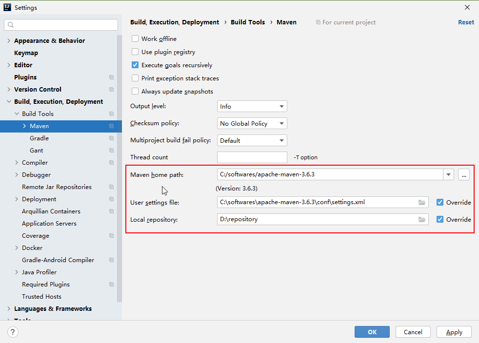
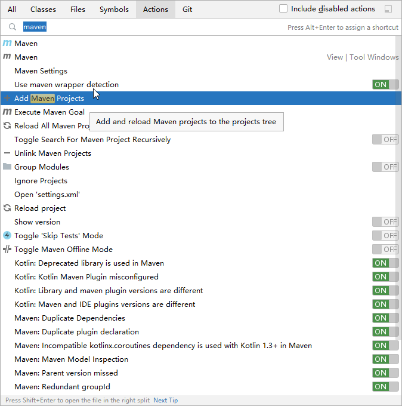
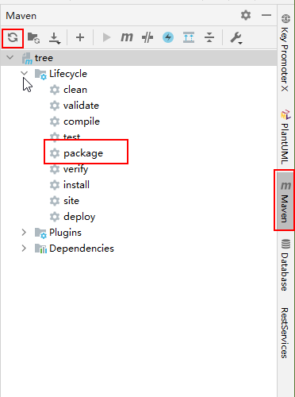

### 1. 环境配置（Windows）

#### Java 下载

Java 11： https://www.oracle.com/java/technologies/javase-jdk11-downloads.html

#### Maven 下载

Maven 3.6.3: https://maven.apache.org/download.cgi

下载 zip 压缩包后解压即可。

需要修改代理，打开 conf/settings.xml 文件，在 `<mirrors>` 标签内添加一下内容：

```xml
<mirror>
    <id>nexus-aliyun</id>
    <mirrorOf>central</mirrorOf>
    <name>Nexus aliyun</name>
    <url>http://maven.aliyun.com/nexus/content/groups/public</url>
</mirror>
```

#### IDEA 下载：

下载地址：https://www.jetbrains.com/idea/download/#section=windows

导入项目后，先修改 maven 配置（分别是 maven 目录、settings 文件、依赖下载文件夹）：


识别项目为 maven 项目：

1. 左键选中项目文件夹，快捷键 Ctrl + Shift + A；
2. 输入 maven，选择 Add Maven Projects；
3. 选中本项目的 pom.xml 文件夹即可。



识别成功后，IDEA 右侧会出现 Maven 的标签，单击左键展开，如图：



点击左上角的 Reload 图标，下载依赖，直到 pom.xml 中没有标红的线则代表成功。
（如果之前不修改 maven 代理，还有 IDEA 中的配置，会下载失败）

双击 package，打包项目，在 target 目录下生成 jar 文件，后续会介绍怎么使用。

#### MySQL

安装：

在 application-*.yml 文件中修改 mysql 的地址、数据库、用户名和密码：

```yml
url: jdbc:mysql://IP地址:3306/数据库名?serverTimezone=GMT%2B8
username: ****
password: ****
```

#### Redis

```yml
redis:
  # Redis服务器地址
  host: ****
  # Redis数据库索引（默认为0）
  database: 0
  # Redis服务器连接端口
  port: 6379
  # Redis服务器连接密码（默认为空）
  password:
```

#### Minio

```yml
minio:
  # minio 服务器地址
  endpoint: ****
  # minio 服务器端口号
  port: 9090
  # minio 账号名 默认为 minioadmin
  access-key: minioadmin
  # minio 密码
  secret-key: minioadmin
  # 存储桶的名字
  bucket: tree
```

#### 邮箱

```yml
mail:
  # 采用 163 的邮箱
  host: smtp.163.com
  # 邮箱账号
  username: ****
  # 邮箱授权密码（不是邮箱密码，是“授权密码”）
  password: ****
```

### 部分项目文件解释

#### 1. 配置文件 application-*.yml		

`*` 位置是环境，此项目包含 dev 和 prod 环境，当运行程序时，可以根据指定的环境切换配置文件。

IDEA 中 Edit Configurations(右上角运行键旁边的下拉框) -> Program arguments 选项中填写 `--spring.profiles.active=dev`。

运行 jar 包时，`--spring.profiles.active=prod`，（参考 Dockerfile 文件）

注意，配置文件内容中的空格，只能是两个空格，多了少了都不行。冒号后面必须要有一个空格。

#### 2. 日志管理文件 logback-spring.xml

文件名默认为这个，不要改（官方定的）。

管理日志输出格式，输出位置，分类输出等。

目前输出到 ELK 管理系统中。

#### 3. 启动文件 TreeApplication 

项目的入口文件，启动文件，可以直接运行这个文件启动项目（方式之一，还可以用 maven 启动）

`@SpringBootApplication` 注解为三合一注解，意义自行查看，无需修改。

其他层文件应在启动文件所在目录相同，或者所在目录的子目录，否则 Spring 将无法扫描文件。


#### 4. Controller 控制层

`@Controller` 与 `@RestController` 注解，后者表明每个方法都是 Rest API，返回的是 JSON 数据。
前者表明将此类作为一个 Bean 托管给 Spring 来管理，且表明这是一个控制器类。

类上面的 `@RequestMapping` 为此类的路由，方法上面的 `@GetMapping` 等为此方法的路由，
方法的路由等于类的路由加上方法的路由。

`@GetMapping` 只接受 Get 方式请求，`@PostMapping` 只接受 POST 方式请求，`@RequestMapping` 任意方式。

返回值，为了统一标准，进行了封装，封装代码参考 /dto/result/HttpResult

为了使抛出异常、以及 404 返回的数据与正常返回的格式相同，查看 exception/GlobalException 和 NotFoundException 类。

#### 5. Service 服务层

面向接口编程，先编写接口，再写实现类。

在实现类上，标注 @Service，表明将此类作为一个 Bean 托管给 Spring 来管理。

这样在 Controller 层，就可以使用自动注入了，而不是使用 new 的方式来生成对象。
例如：
```java
@Autowired
private UserService userService;
```

### 插件介绍

#### 1. lombok

pom.xml 中要导入依赖包，而且 IDEA 中也要下载插件。

`@Data` ：自动生成 Getter、Setter、toString 等方法，减少代码量。

`@Slf4j`：可以直接使用 `log.info` 等方法打印日志。

#### 2. hutool 工具

常用的 Java 工具类。

参考：https://www.hutool.cn/docs/#/

#### 3. knife4j

swagger ui 的加强版。自动生成接口文档，根据注解生成接口说明。

查看：http://localhost:2399/doc.html#/home

注意：不要忘记换 ip 地址和端口号

配置文件详情查看：`config / SwaggerConfiguration.java`

#### 4. 


### 部署

#### 1. Docker 方式部署

Docker 安装教程：https://yeasy.gitbook.io/docker_practice/install/ubuntu

将 mvn package 生成的 jar 文件和项目根目录下的 Dockerfile 文件放在服务器的一个目录下

如果是更新容器的话，需要先删除原有容器：
```
docker container rm -f tree-server
```

构建新容器：
```
docker build -t tree/server:0.0.1 .
```

运行新容器：
```
docker run -p 2399:2399 --name tree-server \
 -d tree/server:0.0.1
```


### 第三方登录

微信登录，需要企业认证，花钱（300 大洋），目前用支付宝代替。

参考：
https://justauth.wiki/oauth/alipay.html

